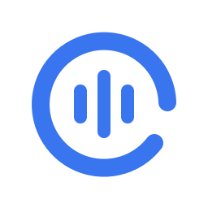
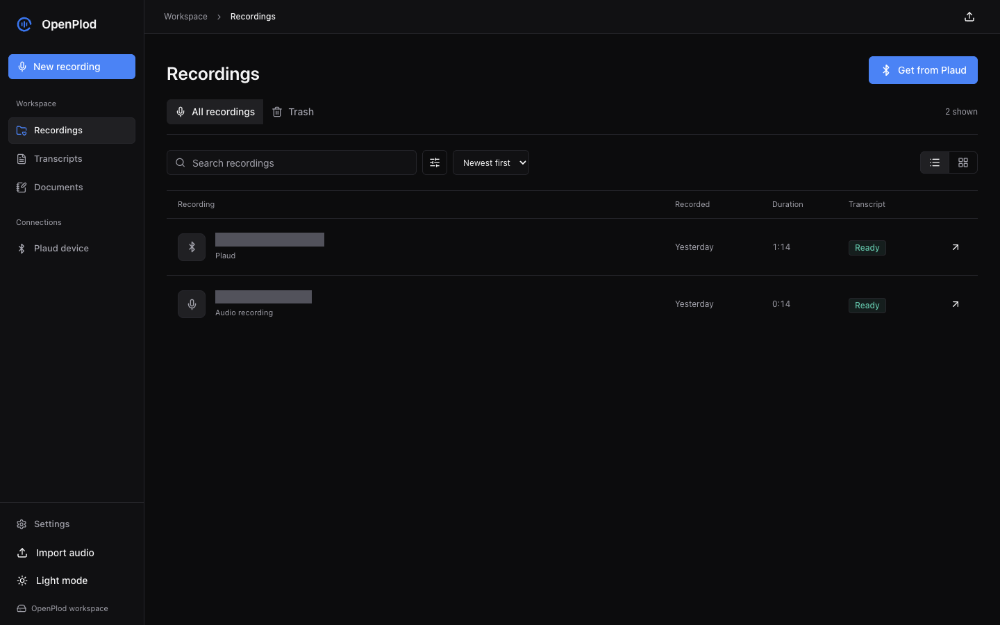

<p align="center">
  
</p>

<h1 align="center">OpenPlod</h1>
<p align="center"><strong>Plaud recordings. AI transcripts. Your Markdown workspace.</strong></p>
<p align="center">A desktop-first audio vault with direct Note Pro imports on macOS, Mistral document generation, an Android companion, REST API, and MCP.</p>
<p align="center">
  <a href="https://github.com/RemiPelloux/OpenPlod/releases/tag/v0.3.0"></a>
  <a href="https://github.com/RemiPelloux/OpenPlod/actions/workflows/ci.yml"></a>
  
  <a href="docs/mcp.md"></a>
  <a href="#sponsor-and-support"></a>
</p>
<p align="center">
  <a href="#get-started">Get started</a> &middot;
  <a href="#get-recordings-from-plaud">Plaud connection</a> &middot;
  <a href="#android-companion">Android</a> &middot;
  <a href="ROADMAP.md">Roadmap</a> &middot;
  <a href="docs/api.md">API</a> &middot;
  <a href="docs/mcp.md">MCP</a> &middot;
  <a href="CHANGELOG.md">Changelog</a> &middot;
  <a href="#sponsor-and-support">Sponsor</a> &middot;
  <a href="https://github.com/RemiPelloux/OpenPlod/issues">Report an issue</a>
</p>

OpenPlod brings recording, playback, transcription, and export into one desktop-first workspace. The Mac app owns the durable audio vault; the Android companion connects to it over your private network. Keep recordings on your Plaud, keep a copy on your computer, and work with transcripts as documents.

> [!IMPORTANT]
> **0.3.0 is an experimental prerelease, not a plug-and-play Plaud replacement.** Direct Bluetooth extraction has been verified on one authorized Plaud Note Pro and an Apple Silicon Mac. Other devices and firmware are not established. Initial desktop authorization still requires a privately provisioned identity; there is no self-service authorization wizard yet. You can use the recording vault, microphone, file imports, transcripts, and documents without a Plaud identity.



*Actual application and local vault. Recording titles are masked for privacy; no mock records or fabricated processing results are shown.*

## Download

| Platform | Package | Notes |
| --- | --- | --- |
| macOS Apple Silicon | [OpenPlod 0.3.0 ZIP](https://github.com/RemiPelloux/OpenPlod/releases/download/v0.3.0/OpenPlod-0.3.0-macos-arm64.zip) | Ad-hoc signed, not notarized. Requires external tools for direct Plaud extraction. |
| Android ARM64 | [Build instructions](#android-companion) | Installed/tested as a development build. Public SDK-containing APK distribution is withheld pending licensing permission. |
| Source | [Tagged source and release notes](https://github.com/RemiPelloux/OpenPlod/releases/tag/v0.3.0) | Includes frontend, backend, native adapters, API, MCP, and tests. |

Download `SHA256SUMS.txt` from the same release and verify the ZIP with `shasum -a 256 -c SHA256SUMS.txt`. Extract the archive, move `OpenPlod.app` to Applications, and open it. macOS may require explicit approval in Privacy & Security because the build is not notarized. Verify the source and checksum before approving it; do not disable Gatekeeper system-wide.

**Upgrade safely:** quit OpenPlod, back up the full vault, and replace only the application bundle. Do not delete its Application Support directory. Android development updates use an in-place install with the same application ID and signing key; uninstalling first can erase phone-local data.

## From Audio to a Document

1. **Capture or import.** Record in OpenPlod, import an audio file, transfer from the paired phone, or use **Get from Plaud** with an authorized Note Pro.
2. **Keep a durable copy.** OpenPlod stores the audio in the desktop vault before acknowledging a mobile transfer. Direct Plaud imports retain the source session on the device.
3. **Transcribe.** Select Mistral Voxtral, local whisper.cpp, or Deepgram in Settings. Processing failure does not delete the recording.
4. **Create a document.** Open a transcript, select **Create document**, choose structured notes, meeting minutes, or a project brief, and add optional instructions.
5. **Review and organize.** Mistral returns Markdown for review. Saving creates an independent document with source references; move it into a folder, edit it, or restore a prior revision.
6. **Export or connect.** Download Markdown/JSON, send a saved document to a configured destination, or let a trusted MCP client read it.

The source transcript, generated document, and original audio are separate resources. Editing the document does not rewrite the source recording.

## What You Can Do

- **Get recordings from Plaud.** Open **Get from Plaud** in Library or New Recording, connect, select recordings, and import them. Filter New/Saved, sort by size, cancel the remaining batch, retry, restore a saved item from Trash, or open it in the library.
- **Keep your audio.** Import files, capture microphone audio, or receive recordings from the paired mobile app. The vault tracks stable recording IDs, content fingerprints, and source provenance.
- **Work in Markdown.** Browse the Transcripts tab, read and edit documents, inspect generated and manual versions, and export Markdown, plain text, or JSON. Reprocessing adds a generated version without silently replacing a manual edit.
- **Organize your notes.** Create nested folders in Notes, import Markdown files, edit/preview documents, star notes, restore history, and recover notes from Trash. Use **Create document** on a transcript to generate structured notes, meeting minutes, or a project brief with Mistral, review the Markdown, and save it with source provenance.
- **Connect your tools.** Use the [versioned REST API](docs/api.md) and [read-only-by-default MCP server](docs/mcp.md). Send saved documents to explicitly configured webhook destinations, or export/share Markdown using the native platform controls.
- **Listen and organize.** Play and seek audio, rename recordings, edit metadata, tags, context, and notes, and use Trash to restore deleted items during the 30-day retention period.
- **Choose processing.** Use Mistral Voxtral, local whisper.cpp, or Deepgram. Configure an analysis provider for summaries and action items, or optionally forward recordings to OpenWhistle.
- **Use the same workspace on Android.** QR pairing, microphone capture, audio share/import, transcript views, and the shared Plaud import dialog are included. Mobile transfers retain local audio until the desktop acknowledges storage.

The shared React interface uses shadcn-style Radix controls, light/dark themes, accessible dialogs, keyboard navigation, a real audio timeline, and reduced-motion support. **Recordings**, **Transcripts**, and **Documents** are separate workspaces rather than competing status tabs.

## Current Support

| Capability | Status in 0.3.0 |
| --- | --- |
| macOS desktop vault | Built and tested on Apple Silicon |
| Mac -> Note Pro Bluetooth download | Real recording listed, downloaded, decoded, imported, and played; source session retained |
| Account-free initial authorization | Not verified; the successful test used existing account authorization for device keys |
| Android -> paired Mac -> Note Pro | Shared import UI implemented; final on-phone interaction acceptance remains incomplete |
| Standalone Android -> Note Pro | Experimental official-SDK adapter; hardware extraction not verified |
| Android native-library alignment | APK ZIP and ARM64 libraries pass 16 KB alignment checks; runtime on a 16 KB device still unverified |
| iOS, Windows, Linux direct extraction | Not verified; the current direct transport requires macOS CoreBluetooth |
| Signed store-ready distribution | Not available; Mac ZIP is ad-hoc signed and not notarized |

## Get Started

### Build the Mac App

Install [Bun](https://bun.sh), [Rust](https://rustup.rs), Apple's Xcode Command Line Tools, and the [Tauri macOS prerequisites](https://v2.tauri.app/start/prerequisites/). Direct extraction also needs `swift`, `ffmpeg`, and `ffprobe` available to the app process; these tools are not bundled.

```bash
xcode-select --install
brew install ffmpeg

git clone https://github.com/RemiPelloux/OpenPlod.git
cd OpenPlod
bun install --frozen-lockfile
bun install --cwd web --frozen-lockfile
bun run tauri:build --bundles app
```

The app is built at `src-tauri/target/release/bundle/macos/OpenPlod.app`. Open it from there or place it in Applications. This build is not notarized. Grant Bluetooth access when macOS asks; microphone capture needs its own permission.

The native app starts its own Bun service on port **3487**. Do not run a second backend on that port at the same time.

### Get Recordings From Plaud

1. Authorize the Note Pro for this Mac. The current adapter reads a private `plaud-device.json` from the vault directory; see [device authorization](#device-authorization).
2. Wake the Plaud and keep it near your Mac. Disconnect other clients that may be holding its Bluetooth connection.
3. Open **Library** or **New Recording**, then **Get from Plaud**.
4. Select **Connect** to read the actual device list. A failed or unavailable query is an error, not a claim that there are zero recordings.
5. Select completed recordings and choose **Import**. Progress counts completed recordings, not transferred bytes.
6. Open the saved recording to play it, edit its details, transcribe it, or export a document.

Audio travels directly from the device over Bluetooth. The verified extraction did **not** download audio from Plaud's cloud or transfer it through a phone. The adapter checks transfer framing, size, authenticated decryption, decoded Ogg integrity, and playable duration. It preserves device bytes and decoded audio alongside an M4A playback copy, then checks that the source session is still listed on the Plaud. The device's transfer-tail checksum is retained but its algorithm is not yet validated.

The extraction command set excludes force-clear, ownership reset, and device-file deletion. The folder-import setting for deleting source files is separate from direct Bluetooth imports.

#### Device Authorization

The successful hardware test used the device owner's existing binding credential and signed identity. **Bluetooth discovery alone does not grant recording access.**

The private identity contains the Mac's peripheral identifier, device serial, binding token, signed authorization, and RSA key pair. The default native Mac location is:

```text
~/Library/Application Support/com.openplod.vault/plaud-device.json
```

The file must be owned by the current macOS user with permissions `0600`. For a source-run backend, `OPENPLOD_DEVICE_IDENTITY` can select an absolute path. No identity, account password, embedded vendor secret, or APK is distributed in this repository. Generating a random token or using Android developer credentials does not provision this desktop identity.

**Fresh-install limitation:** obtaining this identity is not yet a supported in-app onboarding flow. Until that is implemented, a new user can use the recording vault and file imports but should not expect plug-and-play Plaud extraction. Do not reset or rebind a device to work around authorization errors.

### Transcription and Exports

In **Settings**, choose **Mistral Voxtral** and enter your own API key. Local whisper.cpp and Deepgram are alternatives. The router tries the selected engine first, then available fallback engines. If audio must remain entirely local, leave cloud provider keys unset and disable OpenWhistle forwarding.

| Provider | Runs where | Setup |
| --- | --- | --- |
| Mistral Voxtral | Mistral cloud | API key in Settings or `MISTRAL_API_KEY` |
| whisper.cpp | Your computer | Install whisper.cpp and configure its model; see [adapter](src/transcription/whisper.ts) |
| Deepgram | Deepgram cloud | API key; supports speaker diarization |
| Summaries/action items | Configured OpenAI-compatible endpoint | `LLM_API_KEY` or `OPENAI_API_KEY`; optional `LLM_BASE_URL` and `LLM_MODEL` |

**Create document** uses the Mistral key configured in Settings for AI document structuring, with optional writing instructions and a review step before saving. The older recording-summary analyzer has separate LLM settings. Cloud transcription sends audio to that provider; document generation and analysis send transcript text. These are separate from downloading audio off the Plaud.

Open a recording or the **Transcripts** tab to preview Markdown, edit a transcript, inspect version history, or export Markdown, text, JSON, and library audio. The selected transcript version is included in document exports. For direct Plaud imports, library audio is the M4A playback copy; byte-for-byte device originals live separately under `recordings/originals/`.

### Android Companion

The Android companion uses the same recording and document workspace. The redesigned 0.2.0 development update was installed and launched on a connected Samsung phone; that proves installation/startup, not every physical-device workflow. This 0.3.0 source release carries the shared workspace and updated branding.

1. Keep the desktop app open and put both devices on a trusted private network.
2. Open desktop **Settings** to display the pairing QR code.
3. Scan it in the Android app. Manual address/token entry is a fallback.
4. Use **Get from Plaud** to access the Mac's adapter. Keep the Plaud near the **Mac**, not just the phone; the dialog explicitly says **Via your paired Mac**.

Mobile-to-desktop uploads verify fingerprints and retain phone audio until durable acknowledgement. Interrupted uploads currently retry the whole file; byte-offset upload resumption is not implemented. The separate native Android Plaud tab uses the official developer SDK and is experimental, not evidence of working standalone extraction.

To build Android, install JDK 17, Android SDK 36, Android NDK, and the [Tauri mobile prerequisites](https://v2.tauri.app/start/prerequisites/#android). Configure `JAVA_HOME`, `ANDROID_HOME`, and `ANDROID_NDK_HOME` for your installation. The verified build used NDK `28.2.13676358`.

```bash
# Read the SDK's distribution terms before fetching or packaging it.
bun run scripts/fetch-plaud-sdk.ts
bun run tauri android build --debug --target aarch64 --apk --ci
bun run check:android
```

The debug APK is produced under `src-tauri/gen/android/app/build/outputs/apk/universal/debug/`. The fetch script pins and checksums the SDK; its binary is ignored by Git. **The SDK repository's Apache license explicitly excludes `plaud-sdk.aar`, which has separate proprietary terms.** A public repository is not permission to redistribute the compiled SDK. No SDK-containing APK is attached to this release. Developer authentication variables in [.env.example](.env.example) apply to the experimental Android SDK route, not desktop authorization. Do not reset device ownership to test that route.

## API and MCP

OpenPlod is both a local application and an automation endpoint. The backend remains the single owner of persisted documents; clients do not open the SQLite database directly.

| Interface | Use it for | Default boundary |
| --- | --- | --- |
| [REST API](docs/api.md) | Folder/document CRUD, revisions, transcript access, generation, exports, and configured delivery | Authenticated `/api/v1` on the desktop service |
| [MCP server](docs/mcp.md) | Let an assistant browse notes, folders, transcripts, and version history | Local stdio, read-only by default |
| MCP write opt-in | Create/edit/move notes and folders; confirmed Trash and restore | `OPENPLOD_MCP_WRITE=1`; no purge, device reset, or external delivery tools |
| [Webhook destinations](docs/api.md#send-to-a-destination) | Send saved Markdown into your own automation receiver | Owner-configured HTTPS destinations and explicit confirmation |

For an MCP client installed on the same Mac, configure:

```json
{
  "mcpServers": {
    "openplod": {
      "command": "/absolute/path/to/bun",
      "args": ["/absolute/path/to/OpenPlod/src/mcp/index.ts"],
      "env": { "OPENPLOD_URL": "http://127.0.0.1:3487" }
    }
  }
}
```

Keep OpenPlod running. On macOS, MCP reads the private pairing-token file automatically; do not paste that token into public configuration. Ask your assistant to find documents, compare decisions, or read a transcript. Its model provider may receive the requested text, so choose the client deliberately. See the [complete MCP setup and tool list](docs/mcp.md).

## Data and Privacy

The native Mac vault is stored at:

```text
~/Library/Application Support/com.openplod.vault/
  openplod.db              Recording metadata, transcripts, versions, settings
  recordings/             Library audio
    originals/            Direct-import originals and provenance
  pairing-token           Private desktop/mobile pairing credential
  plaud-device.json       Private desktop device identity, when provisioned
```

- **Back up the entire vault**, not just the app bundle. Quit OpenPlod before making a filesystem copy so SQLite and audio are consistent. Never delete the vault to upgrade the app.
- **Local storage is not encrypted by OpenPlod.** Protect your OS account, use FileVault where appropriate, and secure backups. API keys are stored locally; Settings returns only whether a key is configured.
- **Keep the service private.** The native app listens on the LAN for pairing and protects `/api` with its token. LAN HTTP is not end-to-end encrypted. Do not port-forward it or expose it to the public internet; use a trusted network or a separately secured tunnel.
- **Trash is not device deletion.** Library records can be restored for 30 days. Expired-trash cleanup runs when the backend starts. Original-sidecar cleanup and cross-peer deletion propagation still need hardening; do not treat purge as certified secure erasure.
- **Do not publish private artifacts.** Credentials, pairing QR codes, vault databases, recordings, SDK binaries, APK snapshots, and local investigation notes are excluded from the source publication.

## Development

The shared frontend is React, TypeScript, Tailwind CSS, Radix UI, and Lucide. Tauri supplies the native shell. The backend uses Bun, Hono, Drizzle, and SQLite. The Mac transport uses Swift/CoreBluetooth, native RSA, and ChaCha20-Poly1305 session encryption.

```text
web/src/                 Shared recording, transcript, settings, and import UI
src/api/                 Recording, mobile, Plaud, and transcript endpoints
src/library/             Durable imports, provenance, versions, forwarding
src/sync/                Bluetooth protocol, transport, audio, folder adapters
src/transcription/       Mistral, whisper.cpp, and Deepgram adapters
src-tauri/               Native shell and platform integrations
scripts/                 Swift bridge, SDK fetch, build and alignment checks
```

For browser development, quit the native app first, then use two terminals:

```bash
# Terminal 1: backend at http://127.0.0.1:3487
bun run dev

# Terminal 2: UI at http://127.0.0.1:5173, proxying /api to the backend
bun run dev:web
```

The source-run backend defaults to loopback and `./data`; unlike the native app, it does not automatically configure a pairing token. Set `OPENPLOD_PAIRING_TOKEN` before binding it to other interfaces. Use `.env.example` as a reference and keep actual credentials in an ignored `.env` file. For native development, run `bun run tauri:dev` instead of the two-terminal setup.

Docker is available for the web vault and file-based imports via `docker compose up --build` at `http://localhost:3456`. **Docker on macOS does not provide the native CoreBluetooth extraction route.** Its default published port is not a public deployment configuration; restrict access before running it on a shared host.

### Quality Checks

```bash
bun test
bun run typecheck
bun run --cwd web lint
bun run build
bun run tauri:build --bundles app

# After an Android APK build, with ANDROID_HOME configured:
bun run check:android
```

The current source validation run passed **76 Bun tests**, type checking, frontend lint/build, and macOS/Android builds. The Android alignment check covers APK ZIP offsets and bundled ARM64 libraries. Organizer tests cover folder/revision constraints, snapshots, indexed search, retention, delivery idempotency, MCP access controls, and Mistral generation failures, cancellation, trace events, and review-before-save behavior. The official MCP client also passed a real stdio smoke test.

Earlier organizer acceptance used an isolated SQLite vault and the real organizer API for Markdown import/export, conflicts, history, Trash, draft recovery, and transcript snapshots. The redesigned UI was subsequently checked against the real installed vault at widths of 320, 390, 768, 1024, and 1440 px: library filtering/sorting, layout switching, Trash, Plaud and Mistral dialogs, document modes, playback, keyboard seeking, and export menus passed without viewport overflow or browser runtime errors. No real webhook destination was contacted. UI dialog checks are not device-transfer or provider-generation tests.

A separate live Mistral check used an actual Plaud transcript and the installed desktop service: generation events, structured French Markdown preview, explicit save, stored provider/model provenance, and unchanged source transcript all passed. The Android redesign update was installed in place and launched successfully, with all six bundled ARM64 libraries passing 16 KB alignment checks. Complete on-phone generation, transfer, and export acceptance remains separate. No mock provider is used in the runtime application.

Hardware evidence is separate: one approximately 76-second Note Pro recording was downloaded directly on Mac, decoded, imported, and played, and its source session was still present. This does not establish compatibility across devices or replace interrupted-transfer and fresh-install acceptance. The final installed-phone touch-flow check remains incomplete. See [ROADMAP.md](ROADMAP.md) for outstanding gates.

## Troubleshooting

| Symptom | Check |
| --- | --- |
| Plaud is visible but recordings are unavailable | Presence is not authorization. Confirm the private identity, Bluetooth permission, and that another client is not holding the device. |
| "Authorize this Note Pro on this Mac" | Desktop identity provisioning is incomplete; Android developer credentials are a different route. |
| Audio verification or conversion fails | Ensure `ffmpeg` and `ffprobe` are accessible to the app process. Finder and terminal environments may differ. Keep the source on the Plaud. |
| Phone cannot reach the vault | Keep the Mac app open, check the local address/firewall, use the same private network, and rescan the pairing QR. |
| Transcription fails | Check the selected engine and credentials. A saved recording is retained independently of processing success. |
| Startup cannot reach the local service | Check for another process on port 3487. Do not run native and development backends together. |
| Android reports a 16 KB alignment error | Rebuild current sources and run `bun run check:android`; older APKs used an incompatible native encoder. |

## Contributing

Open an issue with your OS, app version, device model/firmware, reproducible steps, and redacted errors. Clearly distinguish fixtures from actual hardware tests. Do not attach passwords, device identities, private audio, pairing QR codes, or proprietary app files. Keep changes focused and run relevant checks before opening a pull request.

See [CONTRIBUTING.md](CONTRIBUTING.md) for the development checklist and [SECURITY.md](SECURITY.md) for private vulnerability reporting. The most useful contributions now are fresh-install desktop authorization, real-device transfer recovery, data-retention hardening, and physical Android acceptance. See the [roadmap](ROADMAP.md) for concrete exit criteria.

## Sponsor and Support

OpenPlod is maintained by [Remi Pelloux](https://github.com/RemiPelloux). To discuss sponsorship, device testing, or ongoing maintenance support, use the contact channels on that profile.

[**Support OpenPlod / Contact the maintainer**](https://github.com/RemiPelloux)

Support can help fund test devices, Mac/Android compatibility work, fresh-install onboarding, and signed distribution. There is no paid tier, sponsorship entitlement, or response-time commitment implied by this link. You can also help by starring the repository, documenting reproducible bugs, testing upgrades with backed-up audio, or contributing focused fixes.

## FAQ

**Do I need the official Plaud app to download audio?** The verified desktop transfer itself runs directly over Bluetooth, without a phone relay or cloud audio download. Initial device keys still came from existing owner authorization; self-service provisioning is not implemented.

**Will importing remove the recording from my Plaud?** The direct extraction command set does not delete device sessions. The tested source session remained listed after import. Folder-source cleanup is a separate configurable workflow.

**Is everything local?** Audio retention and the organizer are local to the desktop. Mistral/Deepgram transcription and Mistral document generation are cloud operations. Use only local whisper.cpp with cloud keys and forwarding disabled for local-only transcription.

**Can I use Obsidian?** Export Markdown and place it in your Obsidian vault. OpenPlod's folders live in SQLite; there is no automatic bidirectional Obsidian-folder sync.

**Can the phone replace the Mac for Plaud extraction?** Not yet. The shared mobile import workflow uses the paired Mac. The separate Android SDK route is experimental and has not passed standalone extraction acceptance.

**Can I expose the API publicly?** Not with the default LAN configuration. Use a deliberately secured HTTPS deployment and review authentication, storage, and access controls first.

## Credits and Licensing

OpenPlod builds on [jddavenportOpen/openplaud](https://github.com/jddavenportOpen/openplaud). Its upstream README declares MIT, but the inherited repository does not include a standalone license file; licensing provenance should be clarified before relying on a complete redistribution grant. This publication does not relicense third-party material.

The experimental Android adapter uses the [Plaud developer SDK](https://github.com/Plaud-AI/plaud-sdk-public), whose binary terms are separate from the repository's Apache-2.0 code license. Its binary is not included here or in public release downloads. See [third-party notices](THIRD_PARTY_NOTICES.md).

OpenPlod is an independent project, not affiliated with or endorsed by Plaud. Product names and trademarks belong to their respective owners.
